# Karnataka Elevate Stage-3 — Pitch Talk Track (v2)

> **Repositioning:** Same Deck B. Bigger Story.
> From "RapidTools = tooling software" → **"bloc42 = India's manufacturing intelligence layer"** — the software that encodes the tacit knowledge that lets China manufacture at scale, and puts it inside every Indian factory, MSME, and job shop.
>
> **Format:** 15 min presentation + 5 min Q&A · 2 presenters · 3-member Jury
> **Presenters:** Dipasha Mukherjee (co-founder, opens) → Vijay Raghav Varada (founder, technical + story)
> **Slides:** UNCHANGED. Only the spoken narrative shifts.

---

## 0. Company One-Liner (use this when asked "what does bloc42 do?")

> **"We are bloc42. We are encoding manufacturing intelligence into AI — so machinists in Peenya compete with factories in China, and India stakes its claim in a $16 trillion manufacturing opportunity."**

---

## 0b. The One-Line Reframe (memorise this — it anchors everything)

> "India and China have roughly the same population. China makes 28% of everything the world buys. India makes 3%. The difference is not machines — India has the machines. **The difference is encoded manufacturing intelligence**: the knowledge of how to take a digital design and turn it into a manufacturable, quality part, fast, cheaply. China spent 40 years encoding that intelligence across millions of workers. **RapidTools is how India encodes it in software — and closes that gap in a decade, not a century.**"

This is the thesis. Dipasha sets it up. Vijay proves it with his personal story. Every slide after that is evidence.

---

## 1. Scoring-Parameter Map (Hit Every Mark)

| Parameter (Marks)                             | Where We Score It | The Hook to Say Out Loud                                                                                                                                                                             |
| --------------------------------------------- | ----------------- | ---------------------------------------------------------------------------------------------------------------------------------------------------------------------------------------------------- |
| **Depth of R&D (20)**                         | Slides 3, 4, 11   | "10 years writing manufacturing-grade computational geometry. 2 working tools today. 10-tool platform by Month 18. **2 patents filed under this grant.**"                                            |
| **Strength of foundation & technical (20)**   | Slides 3, 4       | "B-spline NURBS + mesh Boolean + LLM intent layer. 0.1 mm tolerance. ASME Y14.5. IATF 16949. **This is not generic AI — it is the same mathematics aerospace uses, at a tenth of the price.**"       |
| **Clarity of commercialisation & model (20)** | Slides 7, 8, 9    | "**Four revenue streams. Land-Expand-Lock-in.** Six VARs. 5,500 warm customers. Honda, TVS, Toyota in pipeline. We do not need to build demand — **we are unlocking demand that already exists.**"   |
| **Potential Socio-Economic Effect (20)**      | Slide 5           | "Every fixture we localise is **₹40,000 not flying out to Germany or Japan.** 600–1,000 shop-floor workers upgraded into digital design jobs by Year 3. Karnataka's Peenya competing with Shenzhen." |
| **Experience & expertise of founding (10)**   | Slides 2, 3, 4    | "I was on the shop floor at Peenya, at 2 AM, hand-holding machinists through GD&T so we could hit the IMTEX deadline. **That experience is what we encoded into RapidTools.**"                       |
| **Budgetary allocation & utilisation (10)**   | Slide 12          | "₹1 Cr deployed in 12 months. **50% R&D, every category within Elevate caps. 14× revenue return by Year 3.** Milestone-linked tranches."                                                             |

Memorise the right-hand column verbatim. Each is a 10-second soundbite you drop multiple times across the 15 minutes.

---

## 2. Time Budget — 15 Minutes, 11 Slides

| Min   | Slide                         | Time     | Purpose                                                     |
| ----- | ----------------------------- | -------- | ----------------------------------------------------------- |
| 0:00  | (Title page)                  | 0:45     | Dipasha: introduce both founders + macro India-China frame  |
| 0:45  | **2. Problem**                | **2:15** | Vijay: personal Peenya/IMTEX story → the intelligence gap   |
| 3:00  | **3. Solution / Innovation**  | **2:30** | Vijay: RapidTools as encoded manufacturing intelligence     |
| 5:30  | **4. Product Readiness**      | **1:30** | Vijay: TRL 6, Honda pilot, end-to-end loop validated        |
| 7:00  | **5. Socio-Economic Impact**  | **1:30** | Dipasha: jobs, MSME uplift, import substitution, Karnataka  |
| 8:30  | **7. Market Landscape**       | **1:15** | Dipasha: $42B TAM, Trinckle/Stratasys validation            |
| 9:45  | **8. Business Model**         | **1:30** | Vijay: land-expand-lock-in, VAR channel, aggregation vision |
| 11:15 | **9. Revenue Model**          | **0:45** | Dipasha: pricing, LTV:CAC, NRR                              |
| 12:00 | **10. Financial Projections** | **1:00** | Dipasha: break-even Yr 3, capital efficiency                |
| 13:00 | **11. Project Milestones**    | **1:00** | Vijay: what ₹1 Cr buys in 12 months                         |
| 14:00 | **12. Total Budget**          | **0:45** | Vijay: compliance + 14× ROI                                 |
| 14:45 | **Close**                     | **0:15** | Vijay: the ask + re-state China thesis                      |

**Rule:** if you fall behind, sacrifice Slides 9 and 10 (tables speak for themselves). Never cut Slides 2, 3, 8 — those carry the founding story, the technical moat, and the commercialisation marks.

---

## 3. Slide-by-Slide Talk Track

---

### TITLE SLIDE — Dipasha opens (~75 seconds)

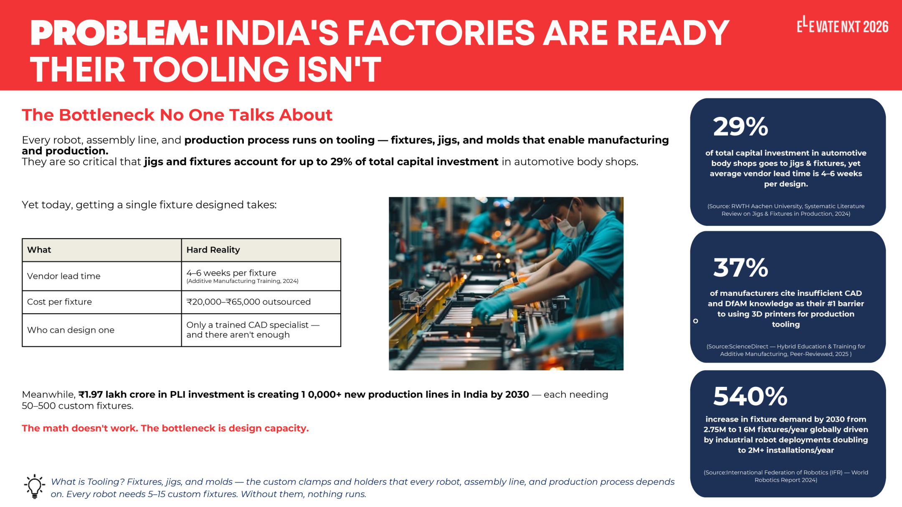

"We are bloc42. We are encoding manufacturing intelligence into AI — so machinists in Peenya compete with factories in China, and India stakes its claim in a $16 trillion manufacturing opportunity."

> "Honourable jury — good morning.
>
> I am **Dipasha Mukherjee**, co-founder of bloc42. With me is our founder, **Vijay Raghav Varada**.
>
> And I want to start with something that should not be true.
>
> India has machines. India has engineers. India has industrial estates — Peenya, Pune, Pithampur. India has 1.4 billion people ready to manufacture for the world.
>
> China manufactures **28% of everything the world buys**.
>
> India manufactures **3%**.

_[Pause.]_

> The problem is not infrastructure. Not policy. The 3,000 job shops in Peenya have been running for thirty years. India has the capacity.
>
> **The gap is not in what India can build. The gap is in how India builds.**
>
> China built an **intelligence layer** — encoded knowledge inside every factory, every supplier, every engineer in their chain. The knowledge of how to take a design from a screen and produce a real part. On time. At cost. Every time. It took four decades.
>
> **India does not have it yet.**
>
> China manufactures **eight times more** than India does — same population, same ambition, different knowledge embedded in the system. Close even a fraction of that gap, and you have the largest economic opportunity in Asia.
>
> Most people picture manufacturing like this: a designer draws a part, a machinist makes it. Two people. One step.
>
> It does not work like that.
>
> Between the designer and the machinist, there is an entire hidden phase of engineering that most people never see. Before anyone can cut, press, or mould the actual component — someone must first design and build the tools that make that production possible. Not the part. The tools _for_ the part.
>
> **Fixtures** — clamps that hold the part in position. **Drill guides** — that land every hole precisely. **Assembly jigs** — that align components while they are joined. **Injection moulds** — a precision steel cavity, machined before a single plastic part is made.
>
> One fixture: three to four weeks. ₹40,000. Multiply across 150,000 Indian manufacturers.
>
> This is not a pain point.
>
> **This is the chokepoint.**
>
> Solve it — for every manufacturer in India — and you do not just build a software company.
>
> **You move India's manufacturing share.**
>
> Vijay will show you how we found it."

---

### SLIDE 2 — THE PROBLEM — Vijay (2:15) [scores: R&D depth, socio-econ setup, founding expertise]

> "Thank you, Dipasha.
>
> Two years ago I was working with a team from IISc — building a precision scientific instrument. A month before IMTEX — the Machine Tool Expo, right here in Bengaluru — our fabrication vendors pulled out. No parts. Hard deadline. No fallback.
>
> So we went to Peenya.
>
> Peenya has world-class CNC equipment. Modern 5-axis machines. We found fabricators with tools that would not be out of place in Germany. **The capacity was there. The machines were ready.**
>
> But the operators could not read our drawings. They had no concept of why a surface finish mattered, or why the fixture holding the part had to be designed before the first cut was made.
>
> So my engineers and I moved into those machine shops. We stood at the CNC consoles. We explained every cut, every tolerance, every setup. We stayed until 2 AM. Multiple nights.
>
> We got the parts done. On time. At quality. And what hit me — those same machine shops, with our engineers standing alongside them, produced work that was competitive with anything a Chinese supplier would have shipped. Same timeline. Same precision. The machines were already world-class. **All they needed was the intelligence on top.**
>
> But that intelligence was us. Two engineers. The moment we left, the machine shop went back to what it was. The knowledge didn't transfer. It didn't scale. And no factory in India can hire two IISc engineers to stand at every CNC console.

_[Pause.]_

> **India does not have a manufacturing capacity problem. India has a manufacturing intelligence problem.**
>
> The machines are ready. The workers are willing. **The knowledge is not in the system.**
>
> Look at this slide. 29% of an automotive plant's capital frozen in tooling. 4 to 6 week lead times. ₹600 crore of precision tooling imported every year from Germany, Japan, Taiwan — not because we cannot make it, **but because we do not have the intelligence in the system to make it fast enough, cheaply enough, right the first time.**
>
> India's factories do in 6 weeks what a Shenzhen factory does in 48 hours. Not because of machines. Because of knowledge.
>
> China produces nearly five times more industrial output per worker — World Bank 2024. More machines explains half that gap. **The rest is knowledge. And knowledge is what software can encode.**
>
> **RapidTools encodes that intelligence.** Starting with tooling — because if you solve fixture design, everything downstream gets easier."

---

### SLIDE 3 — SOLUTION / INNOVATION — Vijay (2:30) [BIG slide — scores: R&D, technical, expertise]

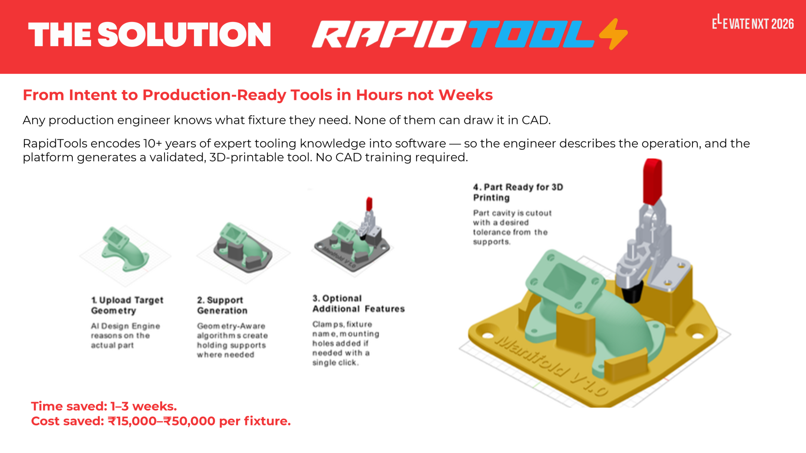

> "An engineer at Honda Kolar opens RapidTools. No CAD degree. No manufacturing expertise. He uploads his part, answers guided questions on screen — surfaces to avoid, where to hold, what the operation is — and the software does the rest.
>
> Two hours later, a finished 3D-printed fixture is on the shop floor. Ready to use.
>
> The traditional way: days of expert design, then a week waiting for fabrication.
>
> **We collapse it to two hours. The software knows. Because we encoded it.**

_[Pause.]_

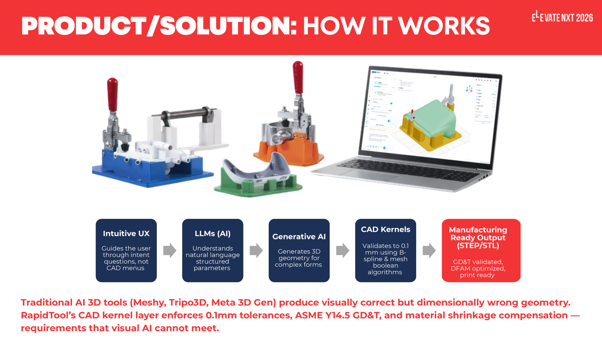

> Generic AI cannot do this. Manufacturing requires precision and repeatability to fractions of a millimetre — every time, without fail. We took a different approach: a geometry engine built on the same foundation as CATIA and SolidWorks. Validated. Deterministic. **A 5 to 10 year engineering moat.**
>
> The AI does not design the fixture. It listens — routes what the engineer describes into the geometry engine. A machinist in Peenya with 15 years of hands-on knowledge but no software background gets a printable file.
>
> **We are not replacing machinists. We are amplifying them.**
>
> I'm a mechatronics engineer at the intersection of Manufacturing, Software, and Automation and i'm converted 15 years of experience, along with various other experts and encoding it in **Production software. Not research.**
>
> Trinckle built the first automated fixture tool in Berlin in 2013. Stratasys acquired them in 2025. But Trinckle serves German customers at German prices. They cannot touch ₹2 lakh Indian price points. They cannot co-develop Honda's quality certification from the shop floor.
>
> **They validated the category. We own the market they cannot reach.**"

---

### SLIDE 4 — PRODUCT READINESS — Vijay (1:30) [scores: R&D depth, technical foundation]

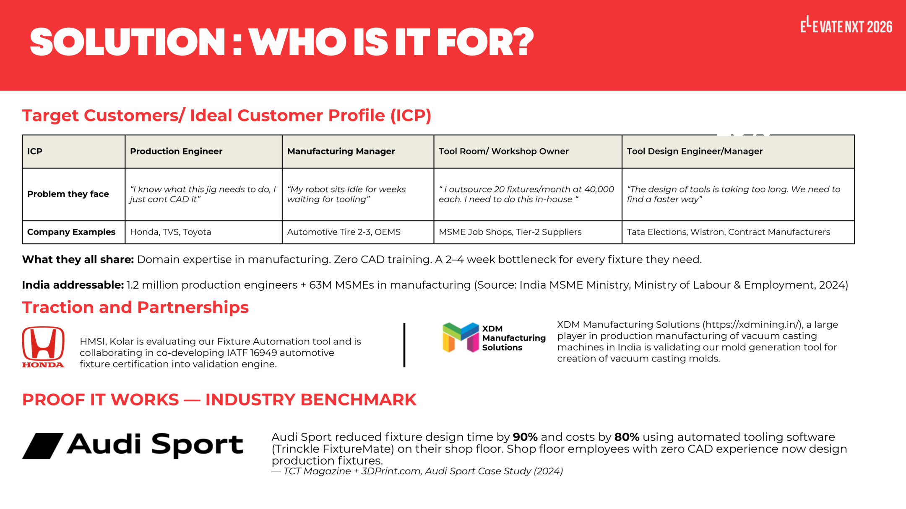

> **Two live pilots. Two real factories. Intent in, manufacturing-ready file out, printed part validated.**
>
> **Honda HMSI Kolar** — 2.4 million motorcycles a year. CAD team 2–3 months backlogged on fixture requests. Our software runs on their internal network today. They invested ₹10 lakh in a Fracktal printer to run our output. That is not a trial. **That is Honda building production infrastructure around our software.** Paid licence converts Q2 2026. IATF 16949 co-development with their quality team.
>
> **XDM Manufacturing Bengaluru** — precision casting. Automated mould design for vacuum casting, running today. Split lines, material flow, shrinkage compensation — all automated. First production-grade mould qualifying now.

> Centum and Tata Electronics in the pipeline.

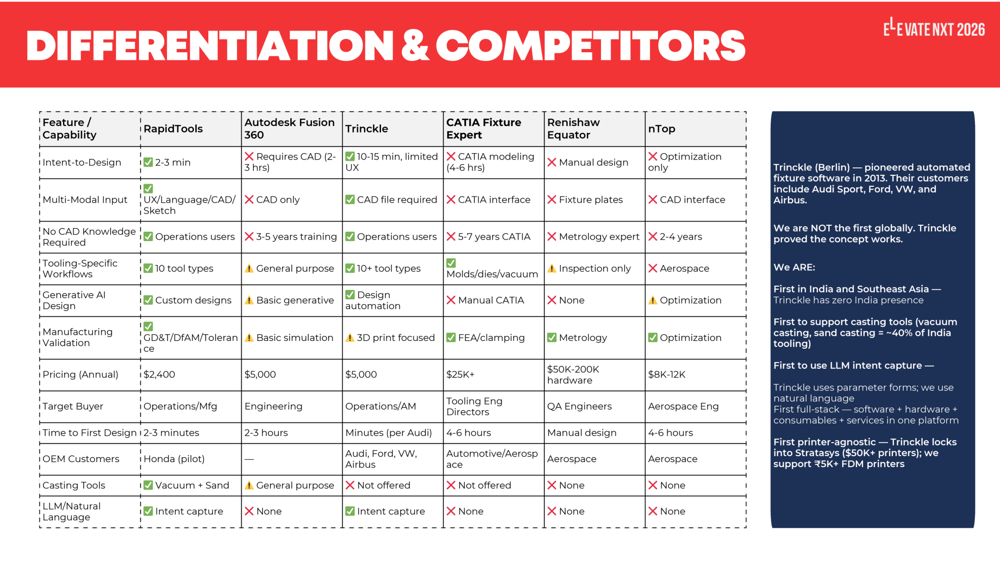

> We position ourselves cometitively against tradional CAD design tools, that are in many ways bleeding the Indian manufacturing system dry, with some of their licences going upto a Crore per seat. We are 10x faster, 5x cheaper, and require no CAD expertise.

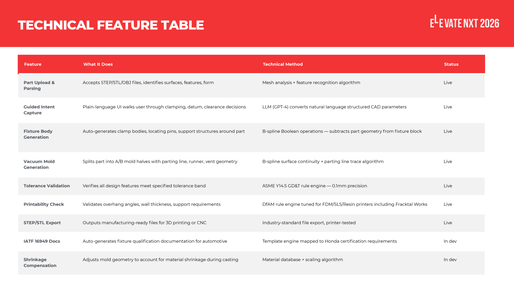

> Every feature on this slide is live: mesh import, GD&T at 0.1 mm, DfAM rules, STEP and STL export, LLM intent. **80% of the platform reuses across every new tool.** Each next tool: 100 engineering hours. **The grant funds acceleration. Not discovery.**

_[Pause. Shift to roadmap.]_

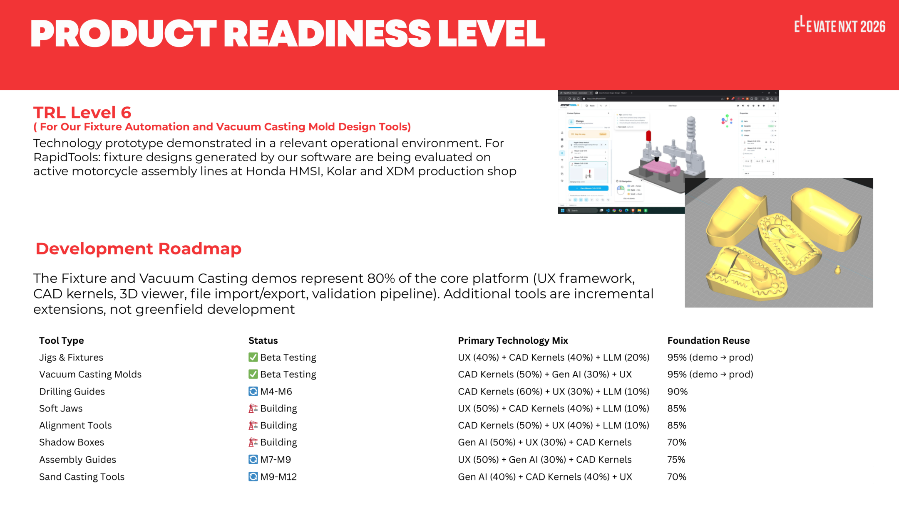

> That is where we are. Here is where we are going.
>
> The destination is a complete AI-enabled manufacturing platform. An engineer imports a part — enters material, volume, tolerances, process — and the system generates everything: the production plan, every manufacturing tool, accurate cost estimates, confirmed lead times. Automatically. No expert interpretation required.
>
> **Import a part. Get a full plan. Manufacture with certainty — deterministic, high-quality, every time.**
>
> Fixture design is the first domain. Mould design is the second. Each tool we build is one more domain of that platform. By the time we have ten tools live, an Indian manufacturer will be able to walk in with a part drawing and walk out with a complete production brief — no imported expertise, no weeks of back-and-forth, no guesswork on cost or timeline."

---

### SLIDE 5 — SOCIO-ECONOMIC IMPACT — Dipasha (1:30) [full 20 marks — slow down, speak clearly]

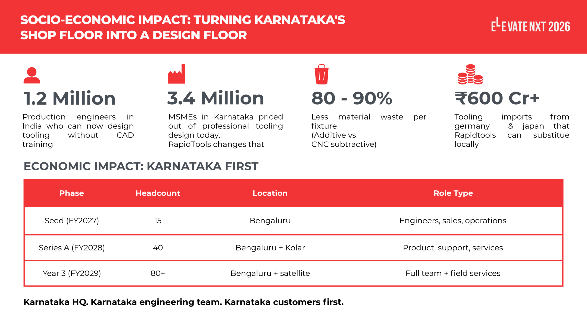

> "Karnataka. 3.4 million MSMEs. 15% of India's industrial output. Honda, TVS, Toyota source from factories in this state — and those factories are losing weeks and lakhs on every single tooling cycle.
>
> Direct jobs we create: 180-plus by Year 3. Every one in Bengaluru. Manufacturing engineering and software design roles — built in Karnataka, not outsourced.

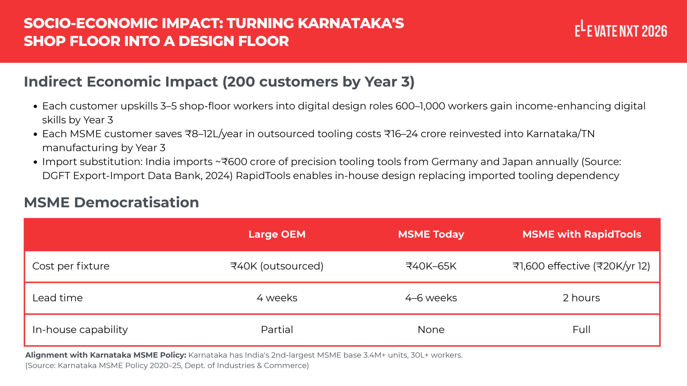

> The deeper impact: 600 to 1,000 shop-floor workers across our customer base gain access to this tool. A production technician earning ₹25,000 a month adds fixture design to their skillset — and earns ₹15,000 to 20,000 more every month. **That income lift is permanent. It compounds over a career.**
>
> ₹600 crore of precision tooling leaves India every year — to Germany, Japan, Taiwan. Not because we cannot make it. Because we do not have the intelligence in our system to make it fast, cheap, and right the first time. Our Year 3 customers alone redirect ₹16 to 24 crore of that spend back into Karnataka. **Every fixture designed by RapidTools is a fixture not imported.**
>
> The job shop in Peenya gets the same capability as the Tier-1 supplier in Pune. That is how India closes the gap — not by building more factories, but by making every factory that already exists smarter."

---

### SLIDE 7 — MARKET LANDSCAPE — Dipasha (1:15) [scores: commercialisation, market depth]

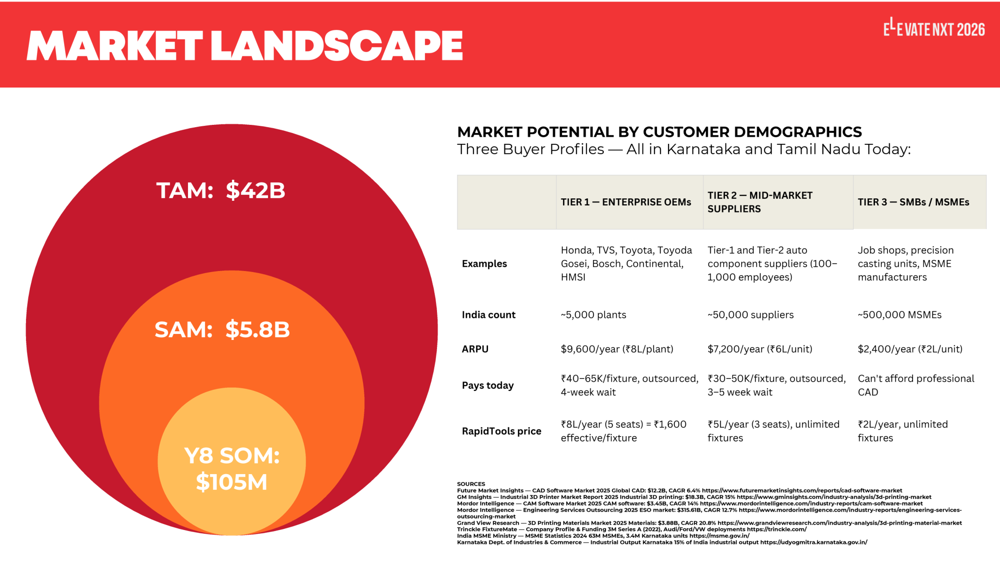

> "₹3.5 lakh crore globally — software, services, hardware, materials — the full manufacturing intelligence stack. India's addressable share today: ₹15,000 crore. Expand to Southeast Asia and that becomes ₹48,000 crore.
>
> Three buyers. Five thousand enterprise OEM plants — Honda, Toyota, Tata. Fifty thousand mid-market tier-1 and tier-2 suppliers. Five hundred thousand MSMEs. One platform. Three price points. Every one of them already feeling the problem we just described.
>
> Year 8 target: ₹875 crore. 1.8% of the India-SEA SAM.
>
> Trinckle built this category in Europe and Stratasys paid to acquire them. Global demand validated. Nobody has built it for India — not at Indian price points, not inside Indian factories, not with Indian OEM certification. **That is the white space we are standing in.**"

---

### SLIDE 8 — BUSINESS MODEL — Vijay (1:30) [scores: commercialisation — full 20 here]

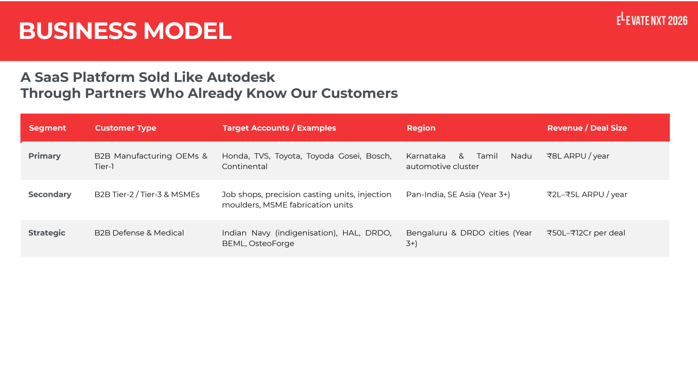

> "Software at ₹2 lakh a year. A production engineer starts with fixture design. In 30 days the licence has paid for itself. **That is the land.**
>
> Then — design services. On-site printing. Consumables every month for the next decade. Each stream raises the switching cost. Year 3: 65% of customers on two revenue streams or more. Net Revenue Retention above 100%. **The business grows with zero new customers.**
>
> Six Authorised Resellers already signed. 5,500 warm manufacturing customers between them — the same buyers they already sell SOLIDWORKS and CNC tools to. RapidTools lands on the same sales call. No new doors to knock. Year 2 target: 50 customers. One percent conversion of a base that already trusts our resellers. **We are not creating demand. We are turning on a tap that already exists.**
>
> Long term — every factory running our software is a node. A customer submits a spec, we route to the best machine in the network, quote instantly, ship in 48 hours. **The software is the wedge. The network is the moat.**"

---

### SLIDE 9 — REVENUE MODEL — Dipasha (0:45)

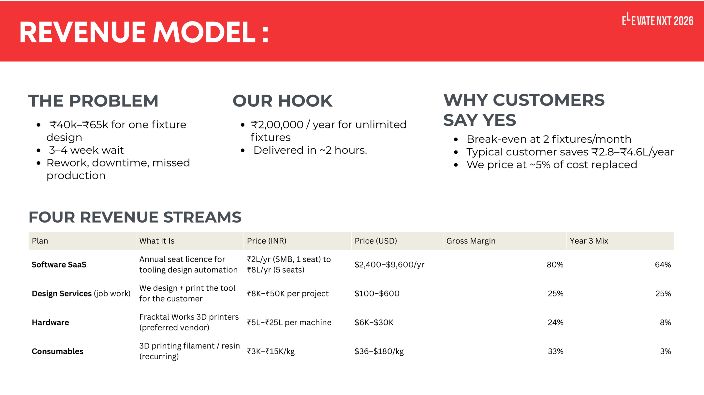

> "A production manager today pays ₹40 to 65,000 per fixture — and waits four to six weeks for it. We charge ₹2 lakh a year for unlimited fixtures in two hours. At two fixtures a month, the licence pays for itself in 30 days.
>
> Four revenue streams: SaaS at 64% of mix, design services at 25%, hardware at 8%, consumables compounding every month on top. Gross margin: 58% in Year 3. LTV to CAC: nine to one at enterprise, twenty to one at MSME. **The industry benchmark is three to one. We are running three to seven times above it.**"

---

### SLIDE 10 — FINANCIAL PROJECTIONS — Dipasha (1:00)

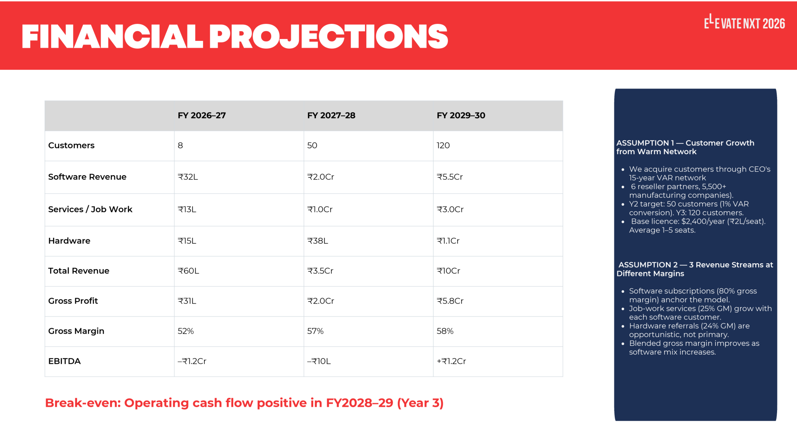

> "Year 1: ₹60 lakh. Year 2: ₹3.5 crore. Year 3: ₹10 crore. **EBITDA-positive at ₹1.2 crore.**
>
> But I want you to hear what this slide actually is. It is not a forecast. It is a proof of viability.
>
> ₹10 crore requires 120 customers — out of 150,000 manufacturers in India alone. 0.08% of the India market. 0.02% of our ₹48,000 crore India and Southeast Asia SAM. We are profitable before we have registered on anyone's radar.
>
> That tells you the unit economics work. The product earns its fee. The model holds.
>
> **From this point, growth is one question: how aggressively do we invest in sales?** Every rupee into the VAR channel converts directly to customers. The manufacturers are there. The resellers are warm. This grant builds the product. The Seed round builds the sales motion. **That is when the curve goes non-linear.**"

---

### SLIDE 11 — PROJECT MILESTONES — Vijay (1:00) [scores: R&D + budget utilisation]

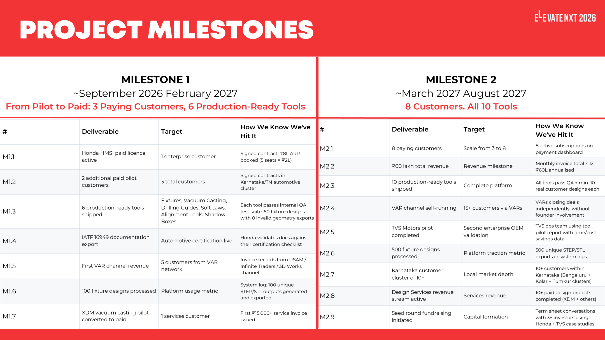

> "Twelve months. Two tranches. Hard milestones — not intentions.
>
> **Month 6:** Honda and two more paying customers on contract. Six tools in production. 100 fixture designs processed. First reseller invoice raised.
>
> **Month 12:** Eight paying customers. ₹60 lakh revenue. Ten tools live. 500 designs processed. TVS pilot complete. Seed round initiated.
>
> Every milestone has a number attached — GST invoice, server log, signed contract. **Nothing in this plan is qualitative.** You either see the evidence, or the second tranche does not release.
>
> **₹1 crore buys a revenue-generating platform, Honda and TVS as paying logos, and the data foundation for the aggregation layer.**"

---

### SLIDE 12 — TOTAL BUDGET — Vijay (0:45) [scores: budget allocation 10/10]

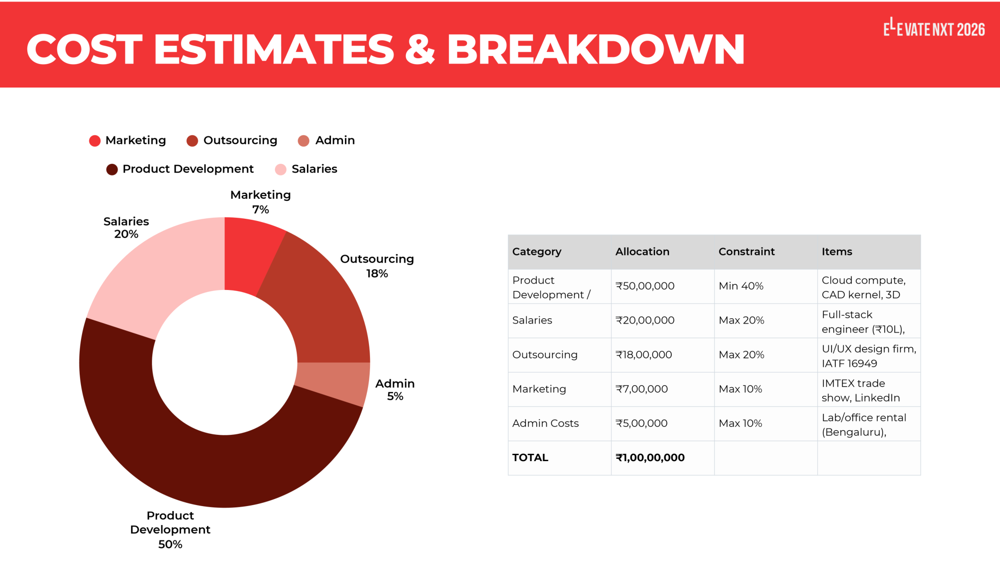

> "₹1 crore. Every category within Elevate caps. Every rupee milestone-linked.
>
> R&D at 50% — above the 40% minimum. Salaries at 20%, non-founder engineers only. Outsourcing 18%, marketing 7%, admin 5%. Tranche 1 releases on company registration. Tranche 2 releases on the Month 6 milestone pack — with receipts.
>
> The R&D line funds the CAD kernel, the DfAM validation lab, two Karnataka-origin patent filings, and IATF 16949 certification alongside Honda's quality team. **Each one is a moat, not an expense.**
>
> Return on ₹1 crore: ₹14.1 crore cumulative across three years. **Fourteen times. Eighty-plus jobs. Sixty-five MSMEs served. Two patents. Karnataka's first deep-tech manufacturing intelligence company — built here, owned here, competing globally from here.**"

---

### CLOSE — Vijay (15 seconds)

> "China: 28%. India: 3%. The gap is not machines. It is not policy. **It is encoded manufacturing intelligence.** bloc42 is building that layer — in Karnataka. ₹1 crore. Twelve months. Fourteen times return. The gap closes here. Thank you."

---

## 4. Q&A Preparation (5 minutes — the deciding round)

### The 10 Most Likely Questions, With Answers

**Q1. "Aren't you just a software company? How does this become a manufacturing platform?"**

> "We embed first, then aggregate. Phase 1 — now through Year 2 — we are inside manufacturing firms as a design tool. Phase 2 — Year 3 onwards — once we have hundreds of machines using our output, we add a routing layer: a customer submits a spec, we quote instantly, route to the best machine in our network, and ship in 48 hours. At that point we are the intelligence layer connecting Indian design capacity to Indian manufacturing capacity. The software subscription is the entry. The network is the long-term business. Honda bought hardware before software — they are already a node in that network."

**Q2. "Why can't a company like Autodesk or Siemens just build this for India?"**

> "Their core product — SOLIDWORKS, NX (the leading industrial design platforms) — sells at ₹2–4 lakh per CAD seat per year. If they build a no-CAD-required tool, they cannibalise their own revenue. Their best engineers will not get budget approval to undercut the product line. This is a classic innovator's dilemma — the big company cannot act. We saw the same dynamic in Europe: Trinckle built the fixture automation category and Stratasys had to acquire them because they could not build it internally. **The 18–24 month window we have is structural, not accidental.**"

**Q3. "Stratasys bought Trinckle — what stops them from entering India and undercutting you?"**

> "Three reasons. Pricing: their GrabCAD Pro product is $5,000 a year — more than double ours — calibrated for European manufacturing wages. They cannot reprice for India without destroying European margins. Hardware: their software outputs only to Stratasys printers, which cost $50,000-plus. We support ₹1.5 lakh Fracktal units. Channel: we have six Indian VARs with 5,500 warm customers. Stratasys's India sales team would need 18 months to replicate that reach. By then we have Honda, TVS, Toyota as certified reference customers. **They will partner with us. They cannot afford to compete.**"

**Q4. "Your technology relies on AI — what if AI tools get cheap and someone just builds this in a few months?"**

> "The AI layer is the interface, not the defensibility. What is defensible is the CAD kernel — 10 years of manufacturing-grade computational geometry that produces certified, 0.1 mm tolerance output. Generic AI image tools produce geometry that looks right but fails on a coordinate measuring machine. Our kernel enforces ASME Y14.5. It passes Honda's IATF 16949 audit. **That certification journey alone — 18 months of co-development with Honda's quality team — is a moat that a well-funded competitor cannot shortcut.** You cannot fake the Honda stamp. You earn it."

**Q5. "The services TAM of $20B looks very large — how do you justify it?"**

> "Fair challenge. The services figure is a broad global engineering services estimate — our directly addressable slice for tooling design and job-work services is ₹34,000–50,000 crore globally, India's share roughly ₹1,700–2,500 crore. Even at that conservative floor, our Year 3 services revenue of ₹3 crore is less than 1% of the Indian slice. **The market is not the constraint. Customer acquisition is. And we have a VAR channel with 5,500 warm leads.**"

**Q6. "Honda is a pilot — when does money actually come in?"**

> "Q2 2026 — within the grant period. ₹8 lakh ARR for 5 seats. Honda has already committed ₹10 lakh in hardware to run our software. That capital outlay is the real signal — **procurement departments do not buy ₹10 lakh printers for software they are not planning to license.** The conversion is administrative, not a sales challenge. The IATF 16949 co-development work we are doing together is the 7-year lock-in. That is a relationship, not a contract."

**Q7. "Two founders — can you really deliver 10 tools, 8 customers, and TRL 8 in 12 months?"**

> "The founding team is two. The execution team by Month 3 is eight — two senior engineers, three mid-level developers, and three manufacturing domain specialists. Critically, 80% of the platform foundation is already built and reusable — each new tool takes roughly 100 engineering hours. Ten tools across 12 months is 10 engineering-months of new work on top of an already-proven foundation. Plus: Honda's quality team co-develops the IATF layer with us, XDM validates the casting tools. **We are not building alone. We have OEM engineering teams contributing.**"

**Q8. "What if you do not raise the Seed round on top of this grant?"**

> "The grant alone gets us to ₹60 lakh ARR with Honda and TVS as paying logos and a TRL 8 system. At that revenue and that customer quality, we qualify for SIDBI debt financing, and we are bankable to angel investors. **The grant makes the company default-alive on customer revenue alone.** Seed is the acceleration lever, not the survival condition."

**Q9. "Why Karnataka — and what if Karnataka does not fund you?"**

> "Karnataka because Honda Kolar is here, TVS Hosur is 3 hours away, the Peenya industrial estate that inspired this company is here, our six VARs are headquartered across the Karnataka-Tamil Nadu corridor, and 15% of India's industrial output runs through this state. **The company is organically a Karnataka company.** If Elevate does not fund, we build more slowly on customer revenue — but Karnataka loses the first-mover advantage of being the home state of India's manufacturing intelligence platform. Tamil Nadu, Maharashtra, and Telangana are all running deep-tech manufacturing grants. **This is Karnataka's category to claim.**"

**Q10. "What is the exit story for investors?"**

> "Three validated paths. First — strategic acquisition: Stratasys already proved willingness to pay for this category by buying Trinckle. Autodesk, 3D Systems, PTC are all logical acquirers at 5–8× ARR multiple. Second — IPO: manufacturing intelligence platforms globally command premium multiples as they scale. Third — PE secondary at Series C. **We are not engineering an exit. We are engineering the category.** The exit follows category leadership — and we are the first Indian company in this category with paying OEM validation."

---

## 5. Stage Mechanics — Do Not Lose Marks on Optics

- **Bring:** printed copy of jury email, govt-issued photo ID, business cards, laptop with offline backup of deck, HDMI and USB-C dongles, water bottle.
- **Dress:** business formal. Both founders aligned.
- **Roles in the room:**
  - **Dipasha (co-founder):** Title slide, Slide 5, Slide 7, Slide 9, Slide 10 + Q&A on market, financials, socio-economic impact, team.
  - **Vijay (founder):** Slide 2 (personal story), Slide 3, Slide 4, Slide 8, Slide 11, Slide 12, Close + Q&A on tech, R&D, partnerships, strategy.
- **Dipasha specific note:** You are the first voice the jury hears. Speak slowly and confidently. The China-India macro frame you set in 45 seconds is the lens through which everything else lands. Own the room before Vijay takes over.
- **Vijay specific note:** The Peenya story is your most powerful moment. Slow down. Let the jury picture it — the CNC machines, the 2 AM sessions, the GD&T drawings. Pause after "India does not have a manufacturing capacity problem. India has a manufacturing intelligence problem." Let that land.
- **Pacing cue:** When a jury member writes notes — **pause 2 seconds.** Never talk over the pen.
- **Number to repeat 3+ times across the pitch:** **"14 times return on ₹1 crore grant."**
- **Phrase to never say:** "We are India's first..." without a source. Pair it with: "Trinckle proved it in Europe. Stratasys validated it with cash. We are the Indian chapter of that story."

---

## 6. The Three Things the Jury Must Remember When You Walk Out

1. **"India has the machines. China has the intelligence. bloc42 is encoding that intelligence into software — and deploying it from Karnataka."**
2. **"Honda invested ₹10 lakh in a printer before paying ₹1 in software. The platform is live on a real production floor today."**
3. **"₹1 crore grant. 12 months. 14× revenue return. 2 patents. 80+ jobs. Karnataka-origin deep tech competing with China."**

If you can only say three sentences in the entire 20 minutes — these are the three.

Go bring it home.
